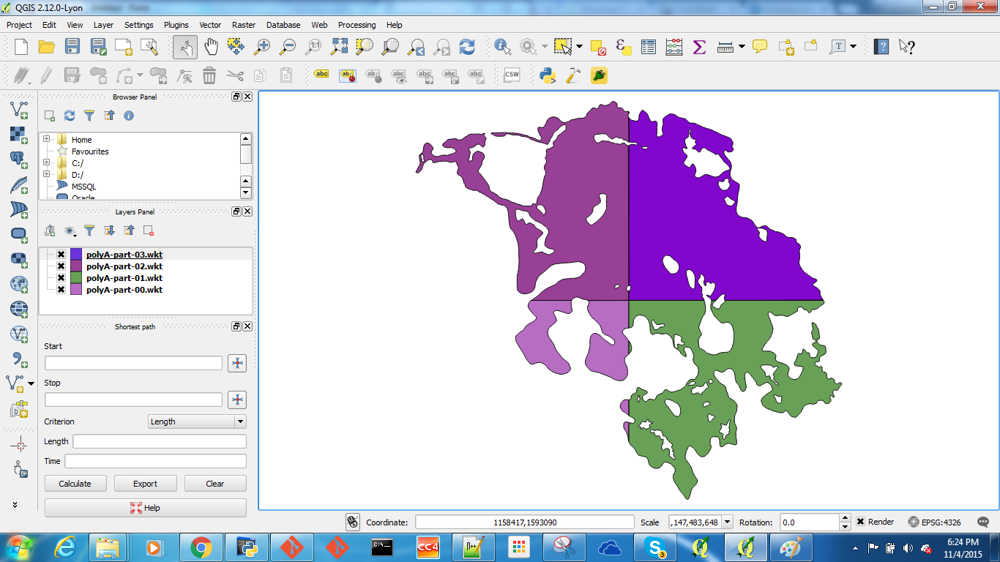

# WKTBulkLoader
A QGIS plugin to bulk load WKT files. Give it a directory and it will load all the `.wkt` files in it.


## To Install
```
git clone https://github.com/siddjain/wkt-plugin.git
```
then
### On Mac
`cd` to `WKTBulkLoader` folder and from there run
```
make deploy
```
This will `build doc transcompile` and install the plugin to the plugins directory.
If you get an error about sphinx, maybe you don't have it on your system. You can install it by doing
```
sudo pip install sphinx
```
Do not `brew install sphinx` as it installs some other software
### On Windows
First, you need to determine the plugins directory. When I installed QGIS on Windows 7, my plugins directory was `/c/Users/siddjain/.qgis2`.
Run following commands from MinGW prompt adjusting the paths as necessary:
```
mkdir $HOME/.qgis2/python/plugins
mkdir $HOME/.qgis2/python/plugins/WKTBulkLoader
cp -vf *.py $HOME/.qgis2/python/plugins/WKTBulkLoader
cp -vf *.ui $HOME/.qgis2/python/plugins/WKTBulkLoader
cp -vf *.txt $HOME/.qgis2/python/plugins/WKTBulkLoader
cp -vf *.png $HOME/.qgis2/python/plugins/WKTBulkLoader
cp -vfr i18n $HOME/.qgis2/python/plugins/WKTBulkLoader 
```

## Development Notes
You may need to add following directories to your paths
```
export PATH="/Applications/QGIS.app/Contents/MacOS/bin:$PATH"
export PYTHONPATH="/Applications/QGIS.app/Contents/Resources/python"
```
e.g., `pyrcc4` is in `/Applications/QGIS.app/Contents/MacOS/bin`
and the `/Applications/QGIS.app/Contents/Resources/python` will be needed to `import PyQt4`

If you already have something in `PYTHONPATH`, add it instead with:
```
export PYTHONPATH="/Applications/QGIS.app/Contents/Resources/python:$PYTHONPATH”
```